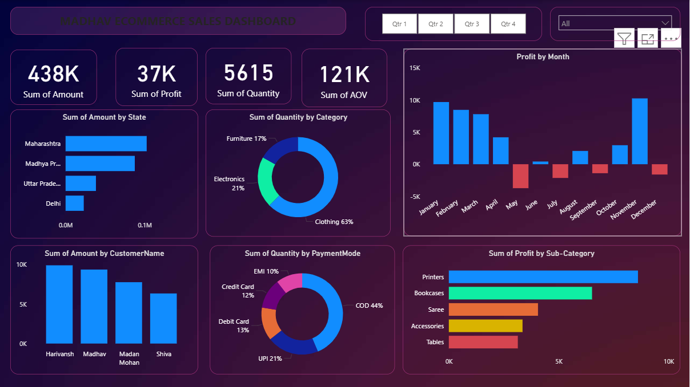

# E-commerce Sales Dashboard (Power BI)

##  Project Overview
This project focuses on analyzing e-commerce sales data to uncover insights related to revenue, profit, and customer behavior. The dashboard helps in understanding business performance and supports data-driven decision-making.

##  Key Features
- Interactive dashboard with KPIs: Sales, Profit, Quantity, and Average Order Value (AOV)
- State-wise and category-wise performance analysis
- Monthly profit trend visualization
- Payment mode distribution analysis
- Dynamic filters and slicers for better data exploration

## 🛠 Tools & Technologies
- Power BI
- Microsoft Excel

##  Key Insights
- Identified top-performing states and product categories
- Analyzed customer purchasing behavior using payment modes
- Detected profit fluctuations across different months
- Highlighted areas of low performance for improvement

##  Dataset
- Details.csv (product, category, payment data)
- Orders.csv (order-level transaction data)

## Data Modeling
-- Combined multiple datasets using relationships in Power BI for better analysis

##  Dashboard Preview

##  Project Files
- Power BI File (.pbix)
- Dataset (.csv)
- Dashboard Screenshot

##  Larnings
- Data cleaning and transformation
- Creating interactive dashboards
- KPI tracking and business analysis
- Converting raw data into actionable insights
